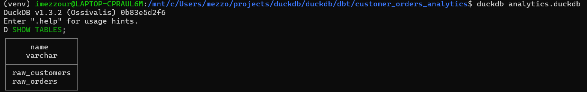
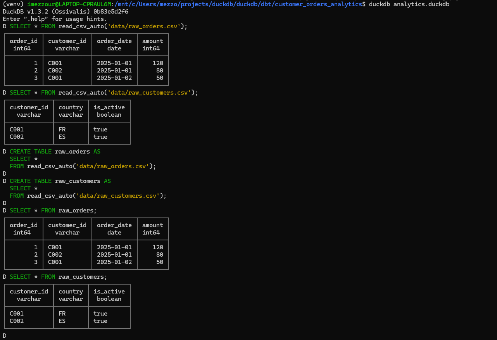
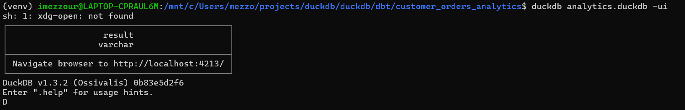
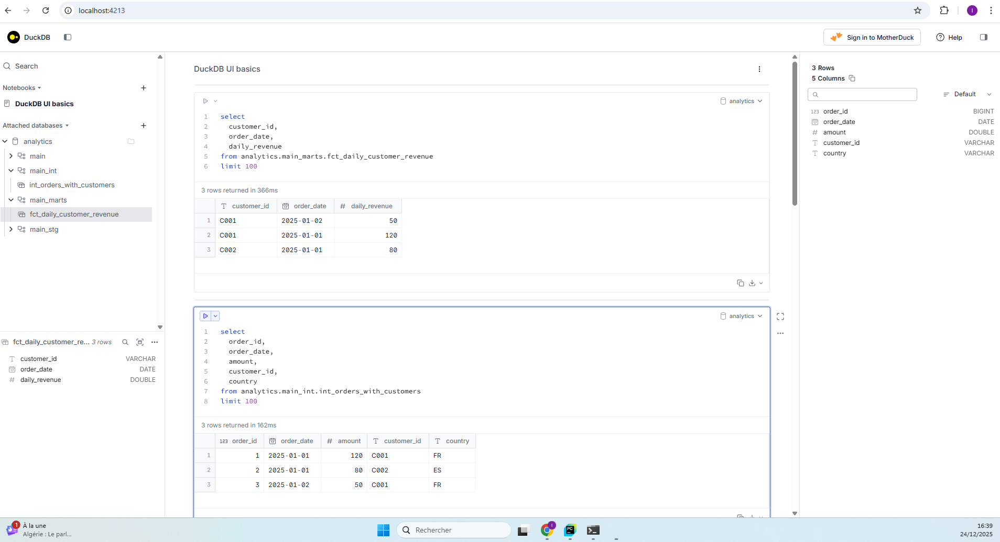

- Get python and install at least the version 3.10. On my side I have the version 3.12.3
- Install package in the venv
  - python3 -m venv venv
  - . venv/bin/activate
  - pip install -r requirements.txt

- Create sources:
  - Start DuckDB (it will create a local database file): `duckdb analytics.duckdb`
  - Check that DuckDB can see your CSV files
```commandline
SELECT * FROM read_csv_auto('data/raw_orders.csv');
SELECT * FROM read_csv_auto('data/raw_customers.csv');
```
  - Create raw tables 
```commandline
CREATE TABLE raw_orders AS
SELECT *
FROM read_csv_auto('data/raw_orders.csv');
CREATE TABLE raw_customers AS
SELECT *
FROM read_csv_auto('data/raw_customers.csv');
```
  - Check that everything is ok 
```commandline
SELECT * FROM raw_orders;
SELECT * FROM raw_customers;
```

  - Check if the table exists in the database: `duckdb analytics.duckdb`

Here you can find the full commands 


- Run your first command:
  - dbt deps
  - dbt debug
  - dbt run

- See the result of the dbt run in a notebook: `duckdb analytics.duckdb -ui`



